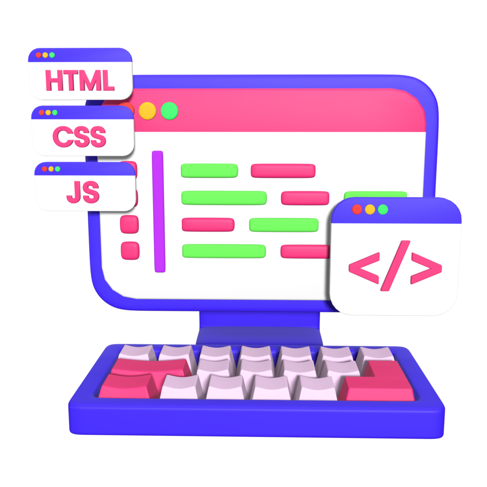
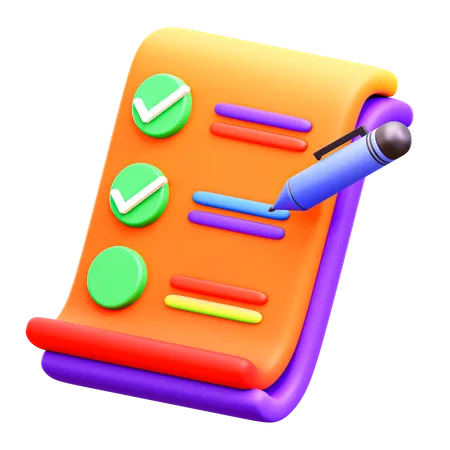

## Initial Impressions

At the beginning of the semester for ICS 414, I wasn't really sure what to expect. I had some idea of how the course would be structured and knew that it would build off of what I had learned from ICS 314, but other than that I had no clue. On the first day of class, we were divided up into our groups for the semester and focused on creating a team name, a team contract, and deciding the beginning steps of development. After discussing a bit about our strengths in terms of software engineering, we found that not only were our skills split between front-end and back-end development but our devices were also split evenly between Windows and Mac. From there, we created a basic team contract for rules member should follow, keeping up with development, being professional, etc. 

We also were informed that the web application we would be developing would be a financial projection and management decision tool for Spire Hawaii LLP, a local Certified Public Accountant (CPA) firm. After brainstorming a bit, we determined the name for our application, which would be "Spire Books". We also discussed how the site should look and concluded that we should base it off of the actual Spire Hawaii site in terms of design so it matches their professional aesthetic. From here, we began development for the project.

## Coding Chronicles

In light of our team name of Team Half & Half, our tasks regarding the project were more or less split between front-end development and back-end development. For the first milestone our goal was to create several mockup pages that would make up the basis for our project. Since I was more confident with front-end development, my tasks for the milestone were to design the Navbar and Footer for the web application, allowing users to easily navigate the site and visit the different pages for the site. While working on this milestone, I also created the logo for our web app, taking inspiration from the original Spire logo.

For the second milestone, we prepared to meet with the customer to present our current application and to receive some feedback. In preparation for this milestone, I worked with the user profiles api and created a User Settings page. This page allowed users to update their account info, mainly their passwords. The following milestone was also a customer milestone where my tasks were split between cleaning up the User Settings page and implementing testcafe tests for a few of the different pages within our application.

At this point, we had reached Milestone 5, where our application as a whole was really starting to take its final form. I focused on minor testcafe implementations, updating the Navbar and Footer component structures for better practice, and cleaning up the code for the Manage Projections page by moving its table into a separate component. In the following customer milestone, I focused on refactoring component code to abide by professional standards and testcafe tests for new pages that had been added.

For the last and final milestone, I did a little bit of testcafe implementations but my main task was to add additional user roles to the application. From the previous customer milestone, we received feedback on a few things, with one of these being the addition of different user roles for the web app. This was brought up as one of the main things to focus on, so I took it upon myself to implement this effectively. While difficult at first, I managed to successfully update the UserProfileCollection api and the Roles api to accommodate for the new roles made. I then removed the previous default accounts we had set in place and made new logins with each corresponding to a role. These roles consisted of the admin role who had access to all pages, the mod role which served as the role for analysts and forecast projectors, and finally the user role which was for the accountants who would input and upload the data from the spreadsheets.

## Conquering Challenges

As with any other project or long term task, there were some challenges that were faced throughout the semester in terms of development and professional practice. I feel that one of the biggest challenges was team communication and coordination. While we did not run into issues within the development environment and did have some communication, I believe that had we had better and more frequent communication we could have accomplished much more for the project. Throughout most of the milestones, we were all working independently on various aspects of the web application which is obviously very common in a professional setting. However, there were points where it felt that the different parts we were working on felt more separate from one another rather than being made to call come together. 

I also believe that another challenge was also group effort, especially when it came towards the later half of the project. This is not to say that members of our team were not working on the project, but in comparison to the early half of the semester, there was a significant decrease in the amount of work and effort that was going towards the project. Perhaps a solution to this would've been more group meetings in person to ensure work was done in that time frame, since for the majority of the semester we all more or less worked independently on our tasks for each milestone. 

One challenge that I feel also applied to the class as a whole was the type of feedback and information we received from the customer. I feel that there were times where we received feedback but were unsure of how to process it or what exactly they were looking for. Perhaps if we had more information as well as a clear vision as to what they wanted for the web application, it would have made it much easier to develop and to adhere to its intended usage. I do understand that this would perhaps dampen the creativity for the project, but I do believe it would have maybe provided more clarity and direction, which felt absent especially at the beginning of the semester.

## Finally Finished Finance

Overall, this semester was able to teach me a lot about how software engineering and working as a team is within a professional development environment. Communicating with the customer helped me to understand how these interactions would play out and how to interpret a customer's feedback. Throughout each milestone, I was able to better my coding skills and standards through each week's code review, allowing me to adapt to professional standards within the industry. While working in a team setting, I was able to better understand the dynamics that form throughout the group, and that communication is essential throughout development. As a whole, I feel that I was able to learn a lot through this class and that it has better prepared me for my future career within the industry of software engineering.
