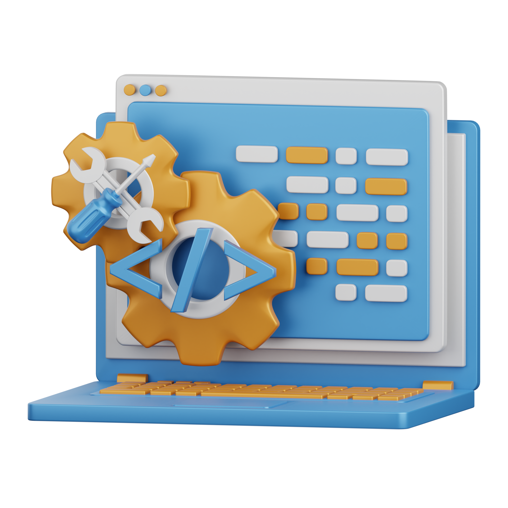
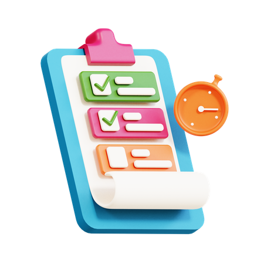
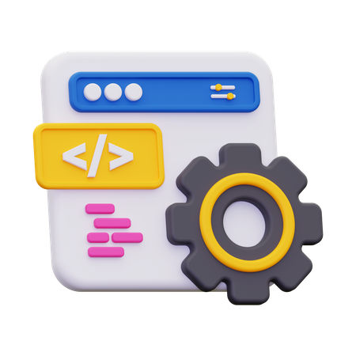

## A Software Saga

Software engineering is the field of computer science that encompasses the design, development, testing, and management of software applications. Through practice, assessment, and real world applications, I have not only learned many different concepts from my education on software engineering, but have developed essential skills that I can utilize moving forward both in my career and personal life. The course in question is ICS 314: Software Engineering I here at the University of Hawai’i at Manoa. This course teaches students the fundamental concepts of software engineering while allowing students to work with real world challenges they may face if they wish to pursue software engineering as a career. This learning process is accomplished through at home practice, in class assessment, and a final collaborative project. This course has not only taught me a lot about software engineering, but has also inspired me to pursue it as a part of my career. While I don’t have the time to discuss everything that I have learned in this short amount of time, allow me to instead focus on what I found to be the most influential concepts that I have learned, concepts of which will continue to influence my work moving forward.

## UI Unisons & Framework Fusions

User Interface Frameworks, commonly referred to as simply UI frameworks, are pre-existing user interface assemblies that can be used as templates for the elements and behavior of an application. Put more simply, they are templates that software engineers can use when developing a new project and optimizes the functionality and appearances of the elements within the front end development of a project. The two UI frameworks that I myself have relied upon are React and Bootstrap, typically combining the two as many of their elements can play into one another. Many software engineers rely upon UI frameworks to not only efficiently develop their project and format the user interface, but also because it makes for better communication amongst fellow software engineers, allowing anyone to read through the code and understand how it operates and where. The widespread usage of these frameworks greatly contributes to collaborative efforts within the scope of software engineering as a whole. If you wish to gain a better understanding of UI frameworks, I have already written an essay where I discuss them and the advantages that come with using them, which you can read [__here__](https://t-tirabassi.github.io/essays/UI_Unveiled.html). 

Within my own experience through studying software engineering, I feel that I no longer can work without using these frameworks, as they genuinely make the process of software development accessible and easily manageable. To take things a step further, I am not necessarily sure where I would even start without the usage of these frameworks, once again highlighting just how influential they have become within the realm of software engineering. To understand how these frameworks, let’s take a look at the Navbar.jsx component for the final project my group and I have been working on in our course for software engineering, which I will discuss more extensively later: 

```jsx
import React from 'react';
import { Meteor } from 'meteor/meteor';
import { useTracker } from 'meteor/react-meteor-data';
import { NavLink } from 'react-router-dom';
import { Roles } from 'meteor/alanning:roles';
import { Container, Image, Nav, Navbar, NavDropdown } from 'react-bootstrap';
import { BoxArrowRight, PersonFill, PersonPlusFill, PersonSquare } from 'react-bootstrap-icons';

const NavBar = () => {
  const { currentUser } = useTracker(() => ({
    currentUser: Meteor.user() ? Meteor.user().username : '',
  }), []);

  return (
    <Navbar bg="dark" expand="lg" className="gradient">
      <Container>
        <Image style={{ marginTop: '8px', marginBottom: '20px', marginRight: '10px', width: '50px', height: 'auto' }} src="./images/uh-warriors-logo.png" />
        <Navbar.Brand as={NavLink} to="/">
          <h2><strong>RepCompanion</strong></h2>
        </Navbar.Brand>
        <Navbar.Toggle aria-controls="basic-navbar-nav" />
        <Navbar.Collapse id="basic-navbar-nav">
          <Nav className="me-auto justify-content-start">
            {currentUser ? ([
              <NavDropdown title="Event" id="navbar-event-dropdown">
                <NavDropdown.Item id="navbar-add-event" as={NavLink} to="/addevent">Add Event</NavDropdown.Item>
                <NavDropdown.Item id="navbar-list-event" as={NavLink} to="/events">Events</NavDropdown.Item>
              </NavDropdown>,
              <Nav.Link id="finder-nav" as={NavLink} to="/filter" key="filter">Finder</Nav.Link>,
            ]) : ''}
            {Roles.userIsInRole(Meteor.userId(), 'admin') ? (
              <Nav.Link id="list-stuff-admin-nav" as={NavLink} to="/admin" key="admin">Admin</Nav.Link>
            ) : ''}
            <Nav.Link id="about-nav" as={NavLink} to="/about" key="about">About Us</Nav.Link>
          </Nav>
          <Nav className="justify-content-end">
            {currentUser === '' ? (
              <NavDropdown id="login-dropdown" title="Connect Now!">
                <NavDropdown.Item id="login-dropdown-sign-in" as={NavLink} to="/signin">
                  <PersonFill />
                  Login
                </NavDropdown.Item>
                <NavDropdown.Item id="login-dropdown-sign-up" as={NavLink} to="/signup">
                  <PersonPlusFill />
                  Register
                </NavDropdown.Item>
              </NavDropdown>
            ) : (
              <NavDropdown id="navbar-current-user" title={currentUser}>
                <NavDropdown.Item id="navbar-profile" as={NavLink} to="/userprofile">
                  <PersonSquare />
                  {' '}
                  Profile
                </NavDropdown.Item>
                <NavDropdown.Item id="navbar-sign-out" as={NavLink} to="/signout">
                  <BoxArrowRight />
                  {' '}
                  Sign
                  out
                </NavDropdown.Item>
              </NavDropdown>
            )}
          </Nav>
        </Navbar.Collapse>
      </Container>
    </Navbar>
  );
};

export default NavBar;
```


     
As you can see, these frameworks can import classes and icons that contribute to the functionality and appearance of the user interface. Essentially these frameworks can condense unnecessarily long code into a single word, which may not seem like much, but makes a huge difference in the time spent coding each line. In this instance, the classes that are imported are used to easily structure the different elements of the Navbar, as well as its features. The icons are also very helpful to have, as React-Bootstrap has a whole catalog of icons that you incorporate into your project based on the context for which you wish to use them. For example, the icons used in the Navbar are a part of the dropdown menu, which allows users to login, sign out, etc. These icons prove helpful as the user can easily identify what these icons mean in relation to the way that they navigate the site. If the user sees the PersonFill icon, they can recognize the connection that has to a profile, and understand that this is where they are meant to login to the application. This makes the application more accessible and makes it easier for first time users to understand how it works as well as how to navigate it.

I believe that UI frameworks are essential in becoming a software engineer, mainly for reasons mentioned previously such as efficiency and communication. The purpose of these frameworks are to be used as building blocks that software engineers can make use of to accomplish their goals. I feel that these frameworks should also be fundamental in the education of software engineering, as it can allow for those unfamiliar with software development to develop stronger skills that are desirable in the workplace. Using these frameworks may also prove quite useful when tackling personal or passion projects, as one of the main factors to account for with any project or challenges is the prospect of time. They provide the foundations for the creation of many applications and work to improve not just the overall esthetic that a project has, but also the functionality and navigability of the project for users. Utilizing UI frameworks has many benefits and are vital tools within the field of ever changing landscape of software engineering.

## Issue Driven Initiative

Issue Driven Project Management (IDPM), also known as Agile Project Management, is a form of project management that allows for groups of developers working together to efficiently keep track of and complete their end goal. IDPM usually consists of a maintained group work schedule, dividing tasks and assigning them to individual group members, working on each task within its own branch, the documentation of each task and its completion, as well milestones which serve to designate the different stages of the project and the deadlies associated with each group of tasks. IDPM is an effective method of planning out a project, working on it collaboratively, and for holding accountability for all those involved. This style of project management benefits heavily from its structure and versatility when it comes to various projects, and can even be applied to other fields outside the realm of computer science.



The experience that I have gained with practicing Issue Drive Project Management comes from the incorporation of it into the final group project for Software Engineering I. For this project, my group and I were tasked with building a web application that could allow students to find and connect with other students to go to the on campus gym. To follow IDPM guidelines, we first planned out which two days of the week we would be able to meet in order to work on the project, and also brainstormed ideas for the start of the project. We then compiled these ideas into a Github Project as issues for the first milestone. This allowed for an organized list of tasks to accomplish and also acted as a checklist of sorts. Working towards this, we each took up different tasks and worked on them in individual branches separate from the main branch, and named each of these branches according to their designated issues numbers. Once each issue was completed, that group member would then assign that issue as done and notify the group of what they had accomplished and that they would be merging those changes into the main branch. On the days that we would meet, we would each discuss what we had been working on, what we had completed, and assist one another with any issues that arose. This routine continued through each milestone until the final product was completed. To better understand how we achieved this while following the guidelines set out for IDPM, feel free to visit [__https://github.com/UH-RepCompanion__](https://github.com/UH-RepCompanion), which is the Github organization that my group and I had formed for this project. From here, you can view the different accomplishments we achieved at different milestones throughout the project.

Overall, I feel that moving forward I can use this style of project management not only for web applications, but also for personal projects as well. For example, one of the things that I would like to get into is game design and development, where the creation of games themselves is a very lengthy and extensive process. I feel that IDPM can prove to be very useful in this setting, as it would allow me to organize the project, provide steady progress and development, and help me set out goals for the project that I wish to meet by a certain time. Specifically with making a game, following IDPM can help me plan out the project so that I am working efficiently while keeping track of each small step I take towards completion. Keeping track of development is also crucial when developing a game as a simple oversight can cause impactful problems later on. Also, if I were to be working with others to develop this game, which is the likely case, IDPM can help in manageable development by assigning each person to different tasks based on their strengths and skills. In fact, many game developers, especially larger companies, use IDPM to develop these global titles and to also meet the deadlines that are announced to the public. It is also apparent when IDPM is performed poorly by these companies with extended delays and cancellations, which is something I would hope to avoid. As a whole, I think Issue Driven Project Management is an essential skill for not just any occupation, but also for taking on real world challenges on a daily basis.


## The Essence of Engineering



Both the usage of User Interface Frameworks and Issue Drive Project Management are only two out of a plethora of knowledge that I have gained throughout my education on software engineering. Honorable mentions for these other fundamentals include the practice of open source software development, which is essentially allowing code from a project to be publicly available inviting use and modification, coding standards, which are fundamental conventions that developer should follow when writing code for readability and neatness, as well as the ethics of software engineering, which allows software engineers to reflect on the rapidly changing landscape of the field, especially with the rise of AI within the past few years. Speaking of which, I have also written an essay regarding my usage of AI in software engineering, which you can read [__here__](https://t-tirabassi.github.io/essays/AI_in_Academia.html). Once again, these are only a few of the things that I have learned and hope to continue to carry this knowledge with me moving forward. In fact, I plan on furthering my knowledge of software engineering through future courses, which will hopefully lead to the start of my career within the field. As a whole, I can say that software engineering has taught me many vital concepts and its impact on my journey through the growing technological landscape cannot be understated.
