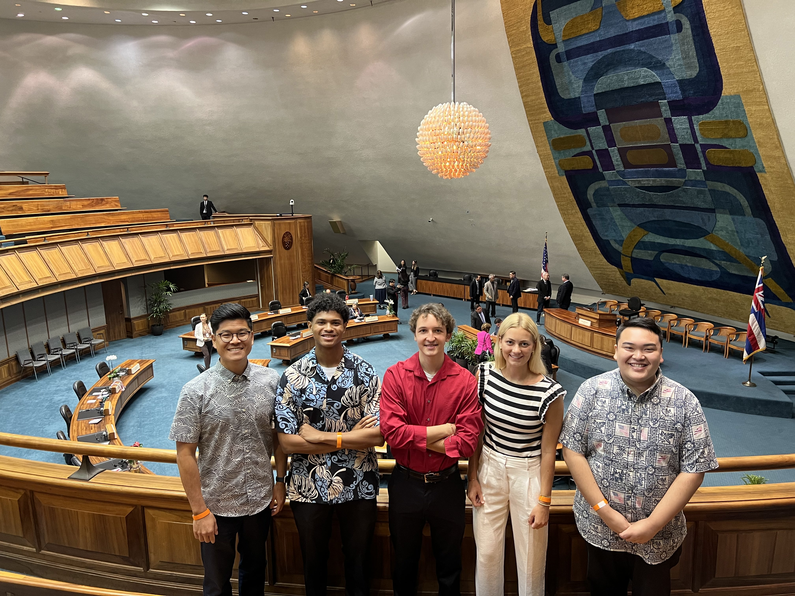
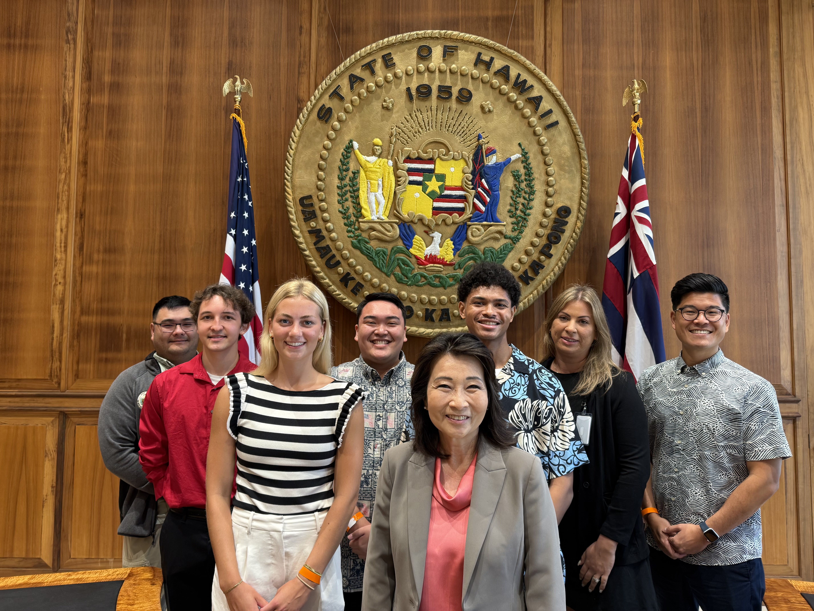

&nbsp;

### What is Moloka'i Connect?

Moloka'i Connect was a team formed through the collaborations between the University of Hawai'i at Manoa (UHM), the Department of Hawaiian Home Lands (DHHL), and the State of Hawai'i, with the sole task of working closely with the Connect Kakou initiative and the Tribal Broadband Connectivity Program (TBCP) to bridge the digital divide faced by the island of Moloka'i. This large-scale project took place over the course of a University semester from January 2025 to May 2025. The team consisted of students Jordan Launstein, Payton Higa, Micah Schoefield, and myself. Each student was given a role to carry out for the project and I was designated as one of the two project managers. My responsibilities included community outreach and interviewing, presentation setup and research, scheduling, solution brainstorming, and product creation. Many of the responsibilities for this project were shared and spread throughout the team. Our goal was to create a product or solution that could be used to combat the initial problem statement, which proved much more difficult than we had anticipated including many dead ends, turns, and ideas being completely thrown out as we learned more about the situation and got to talk to more professionals and locals. We even got the chance to visit Moloka'i and speak to locals personally.

The project process itself is a very long and complicated story, so please feel free to ask me about said process or the project itself in person. Ultimately, we realized that the problem wasn't the connectivity or the resources available to the residents, but the lack of awareness of the resources that were already readily available to them. From this, we decided to develop a resource aggregator that could be used to catalog all existing and previously existing resources. This aggregator was also built with the idea of continued additions as more programs and resources were created. We then presented the entirety of our project timeline, process, what we experienced, what we learned, and finally the resource aggregator itself to the Lieutenant Governor of Hawai'i Sylvia Luke.

&nbsp;

### Photos

&nbsp;

&nbsp;

&nbsp;

&nbsp;

&nbsp;

*(Left) The Moloka'i Connect team with our Professor Jeff Hui at a senate hearing at the Hawai'i State Capitol.*

*(Middle) Moloka'i Connect and the DHHL at our first meeting with Lieutenant Governor of Hawai'i Sylvia Luke.*

*(Right) Moloka'i Connect and the DHHL at our first meeting with Hawai'i State Senator Lynn Decoite.*

&nbsp;

**More photos available upon request**

&nbsp;

**Learn more about the broadband connectivity programs that Moloka'i Connect contributed to by visiting** [https://dhhlbroadband.com/](https://dhhlbroadband.com)

&nbsp;

**Project contacts and/or supervisors available upon request**
