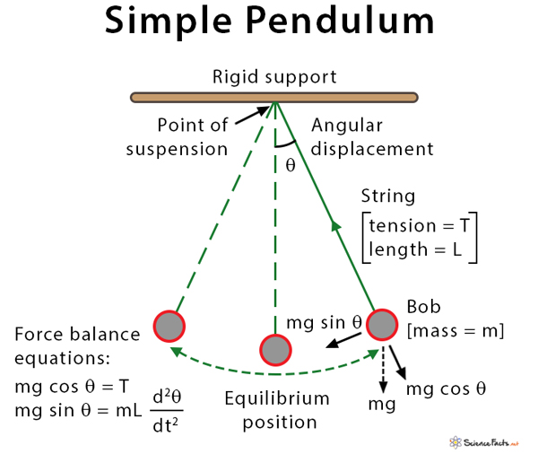

  Back when I was studying mechanical engineering, one of the projects that I was assigned was working in a group to design, build, and demonstrate the physics of a simple pendulum and how those principles can be applied to large-scale industrial projects. This differed from other projects we completed in class, as it did not involve circuitry, electrical engineering, and it was not through an online software. This project required the physical construction of the pendulum with weight, physics, and functionality in mind. I was placed in a group with three other people, and while the project was completed and received well by the professor, it wasn't without its obstacles.

  One of the hard truths that I learned from this project was that not everyone will pull their own weight. Out of the three people within my team, only one person aside from myself actually worked on and contirbuted to the project. Despite my attempts to get the other two members to contribute, it ended up just being myself and the other person contributing, with myself taking the lead. The two of us planned out the pendulum, creating the dimensions and organizing the materials, and then I built the pendulum. The two of us then tested it in preparation for the presentation and recorded the results. My teammate and I notified the professor of the lack of contribution from the other group members, which he took note of in the grading process. This project taught me how to take leadership in spite of undesired circumstances, it taught me how to utilize critical thinking principles, and it taught me skills in organization, design, and collaboration.

Here are diagram schematics of the project from my engineering notebook:

