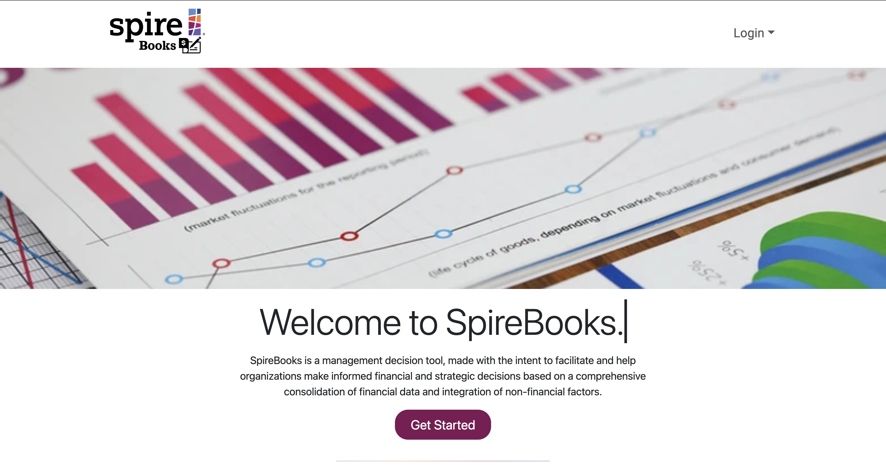
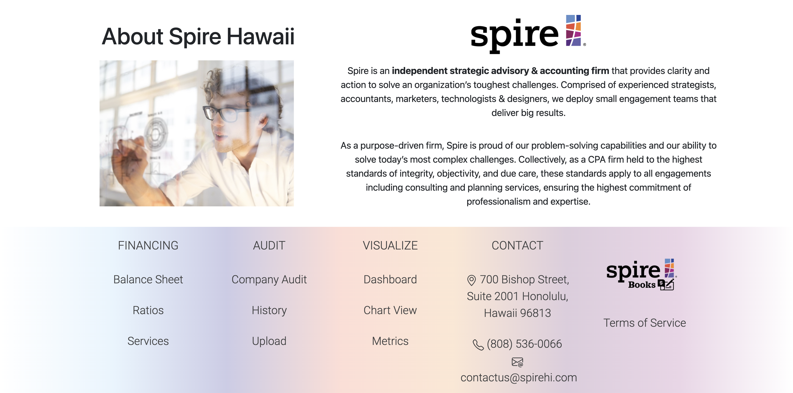

&nbsp;

### What is SpireBooks?

SpireBooks was a financial projection and management decision tool developed for the local CPA firm Spire Hawaii to help the company visualize projections, perform audits, and manage Spire client data efficiently. The application itself was built as a course project for ICS 414, Software Engineerign II by my team, named Team Half & Half.

&nbsp;

&nbsp;

### Problem

Spire Hawaii required a web application for visualizing financial projections, managing client specific data, and providing easy-to-read reports for both Spire employees and client companies.

&nbsp;

### Main Contributions

While I did hold many different duties within Team Half & Half throughout the course of the project, the main contributions I made throughout the various milestones are as follows:

- **UI Design and Functionality**
- **User Roles and Account Data**
- **Application Acceptance Tests**
- **Component Management**
- **Code Refactoring**

&nbsp;

**Tech Stack:** React, Meteor, Bootstrap, MongoDB, HTML, CSS, JSX  

&nbsp;

### Solution

Team Half & Half opted to build a web application that:

- Visualized financial projections through adjustable graphs and forms
- Supported user roles with role-specific access to client data
- Implemented Agile workflows (IDPM) consisting of code reviews, milestones, and assigned tasks
- Relied on maintainable code via component management and refactoring

  

     

&nbsp;

**Impact:** Enabled Spire Hawaii to properly input, track, and interpret financial data, allowing for visualized explanations, efficient auditing, and easily understandable reports that coudld be relayed to Spire clients. 

&nbsp;

More in-depth views of the project and my contributions can be accessed through:  
- Project board: [Projects tab](https://github.com/orgs/Team-Half-and-Half/projects)  
- Team site: [Team Half & Half](https://team-half-and-half.github.io/)  
- Repository: [GitHub repo](https://github.com/Team-Half-and-Half/spirebooks)

&nbsp;

**Note:** The app itself was not deployed publicly due to the contractual partnership with Spire Hawaii.
